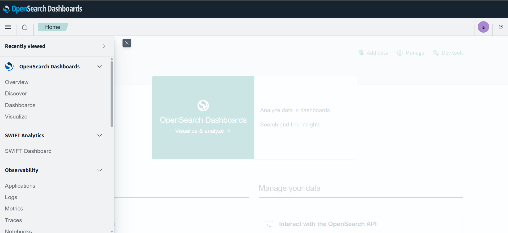

# OpenSearch & OpenSearch Dashboards Setup Guide

This README provides instructions to download, install, and configure OpenSearch and OpenSearch Dashboards using the official sources.

---

## Prerequisites

* Java 17 or later
* Window 10 or 11
* Node.js (for OpenSearch Dashboards : version 20)
* Minimum 4GB RAM for stable operation

---

## Developement Setup

## 1. Download OpenSearch (Version 2.19.0)

Visit the official OpenSearch download page: [https://opensearch.org/downloads/](https://opensearch.org/downloads/)

---

## 2. Download OpenSearch Dashboards (Version 2.19.0)

Visit the official OpenSearch Dashboards download page: [https://opensearch.org/downloads/#opensearch-dashboards](https://opensearch.org/downloads/#opensearch-dashboards)

---

## 3. Configure OpenSearch

Edit `config/opensearch.yml`:

```yaml
cluster.name: opensearch-cluster
node.name: node-1
network.host: 0.0.0.0
http.port: 9200
discovery.seed_hosts: ["127.0.0.1"]
cluster.initial_master_nodes: ["node-1"]
plugins.security.disabled: true
```

> Note: Only disable security for local development.

---

## 4. Configure OpenSearch Dashboards

Edit `config/opensearch_dashboards.yml`:

```yaml
opensearch.hosts: [https://localhost:9200]
opensearch.ssl.verificationMode: none
opensearch.username: kibanaserver
opensearch.password: kibanaserver
opensearch.requestHeadersWhitelist: [authorization, securitytenant]

opensearch_security.multitenancy.enabled: true
opensearch_security.multitenancy.tenants.preferred: [Private, Global]
opensearch_security.readonly_mode.roles: [kibana_read_only]
# Use this setting if you are running opensearch-dashboards without https
opensearch_security.cookie.secure: false
```

---

## 5. Start Services

### Start OpenSearch in Windows

```bash
./bin/opensearch.bat
```

### Start OpenSearch Dashboards in Windows

```bash
./bin/opensearch-dashboards.bat
```

Access Dashboards at [http://localhost:5601](http://localhost:5601)

---

## 6. Verify Setup

1. Open your browser and go to `http://localhost:5601`
2. You should see the OpenSearch Dashboards UI
3. Create indices, build visualizations, or explore logs

---

## 7. Add a Custom Plugin to OpenSearch Dashboards

### Step 1: Clone the OpenSearch Dashboards Repository

```bash
git clone https://github.com/opensearch-project/OpenSearch-Dashboards.git
cd OpenSearch-Dashboards
```

### Step 2: Bootstrap the OpenSearch Dashboards Development Environment

```bash
yarn osd bootstrap
```

> Use **Node.js v20** for optimal compatibility.

### Step 3: Add Your React Project

Place your plugin (React project) inside the `plugins` directory of OpenSearch Dashboards.

* Frontend UI components should go inside the `public` folder.
* Backend/server logic should go inside the `server` folder.

Ensure you use `App.tsx`, `index.ts`, and `plugin.ts` that follow the plugin structure and component usage patterns defined in the OpenSearch Dashboards project.

Your `package.json` should contain a build script like:

```json
"build": "yarn node ../../scripts/plugin_helpers build"
```

You should have a file named `opensearch_dashboards.json` which will contain information regarding the version of the OpenSearch Dashboards and the plugin.

```json
{
  "id": "swift-dashboard",
  "version": "1.0.0",
  "opensearchDashboardsVersion": "2.19.0",
  "server": true,
  "ui": true,
  "requiredPlugins": ["navigation"],
  "optionalPlugins": ["data", "savedObjects"]
}
```

> Follow the existing plugin structure carefully for consistency and component usage patterns.

### Step 4: Build the Plugin

Before building, install dependencies:

```bash
cd plugins/your-plugin-name
yarn install
```

Then build your plugin:

```bash
yarn build
```

### Step 5: Install the Built Plugin into a Packaged Dashboard

Use the `opensearch-dashboards-plugin` utility inside the downloaded OpenSearch Dashboards package to install the plugin zip:

```bash
bin\opensearch-dashboards-plugin.bat install file://./plugins/swift-dashboard-backend/build/swiftDashboard-2.19.0.zip
```

> Replace the path with the actual location of your built plugin zip.

Once installed, launch OpenSearch Dashboards. Your plugin should appear on the left-hand panel.




**Note:** Each time you make changes to your plugin:

* Rebuild the plugin (`yarn build`)
* Remove the previous version from the plugin directory before reinstalling

---


## Deployement Setup

## 1. Download OpenSearch (Version 2.19.0)

Visit the official OpenSearch download page: [https://opensearch.org/downloads/](https://opensearch.org/downloads/)

---

## 2. Download OpenSearch Dashboards (Version 2.19.0)

Visit the official OpenSearch Dashboards download page: [https://opensearch.org/downloads/#opensearch-dashboards](https://opensearch.org/downloads/#opensearch-dashboards)

---

## 3. Configure OpenSearch

Edit `config/opensearch.yml`:

```yaml
########################### Cluster ###########################
cluster.name: opensearch-prod-cluster

############################ Node #############################
node.name: node-1
node.roles: [data, master, ingest]

########################## Network ############################
network.host: 0.0.0.0  # Or better: ["_eth0_", "_local_"]
http.port: 9200

########################### Discovery #########################
discovery.seed_hosts: ["node-1.internal", "node-2.internal", "node-3.internal"]
cluster.initial_master_nodes: ["node-1", "node-2", "node-3"]

######################### Path Settings #######################
path.data: /var/lib/opensearch
path.logs: /var/log/opensearch

######################### Security ############################
plugins.security.disabled: false
plugins.security.ssl.transport.enabled: true
plugins.security.ssl.transport.pemcert_filepath: node-1.pem
plugins.security.ssl.transport.pemkey_filepath: node-1-key.pem
plugins.security.ssl.transport.pemtrustedcas_filepath: root-ca.pem
plugins.security.ssl.transport.enforce_hostname_verification: false

plugins.security.ssl.http.enabled: true
plugins.security.ssl.http.pemcert_filepath: node-1.pem
plugins.security.ssl.http.pemkey_filepath: node-1-key.pem
plugins.security.ssl.http.pemtrustedcas_filepath: root-ca.pem

plugins.security.allow_default_init_securityindex: true

########################### Authentication ####################
plugins.security.authcz.admin_dn:
  - "CN=admin,OU=SSL,O=Test,L=Test,C=DE"

plugins.security.nodes_dn:
  - "CN=node-1,OU=SSL,O=Test,L=Test,C=DE"
  - "CN=node-2,OU=SSL,O=Test,L=Test,C=DE"
  - "CN=node-3,OU=SSL,O=Test,L=Test,C=DE"

########################### Performance #######################
bootstrap.memory_lock: true
indices.query.bool.max_clause_count: 10240
action.destructive_requires_name: true
```

> Note: Only disable security for local development.

---

## 4. Configure OpenSearch Dashboards

Edit `config/opensearch_dashboards.yml`:

```yaml
########################## OpenSearch Connection ##########################
opensearch.hosts: ["https://opensearch-node1.example.com:9200"]
opensearch.ssl.verificationMode: full  # full = verify cert and hostname
opensearch.username: "kibanaserver"
opensearch.password: "your-secure-password"
opensearch.requestHeadersWhitelist: [authorization, securitytenant]

########################## Server Settings ###############################
server.host: "0.0.0.0"  # Or set to internal IP/domain
server.port: 5601
server.ssl.enabled: true
server.ssl.certificate: /etc/opensearch-dashboards/certs/dashboards.pem
server.ssl.key: /etc/opensearch-dashboards/certs/dashboards-key.pem

########################## Security Plugin ###############################
opensearch_security.multitenancy.enabled: true
opensearch_security.multitenancy.tenants.preferred: [Private, Global]
opensearch_security.readonly_mode.roles: ["kibana_read_only"]

# Make sure cookies are secure in production
opensearch_security.cookie.secure: true

########################## Logging (Optional) #############################
logging.dest: /var/log/opensearch-dashboards/opensearch-dashboards.log
logging.verbose: false
```

---

## 5. Start Services

### Start OpenSearch in Windows

```bash
./bin/opensearch.bat
```

### Start OpenSearch Dashboards in Windows

```bash
./bin/opensearch-dashboards.bat
```

Access Dashboards at [http://localhost:5601](http://localhost:5601)

---

## 6. Verify Setup

1. Open your browser and go to `http://localhost:5601`
2. You should see the OpenSearch Dashboards UI
3. Create indices, build visualizations, or explore logs

---

## 7. Add a Custom Plugin to OpenSearch Dashboards

### Step 1: Clone the OpenSearch Dashboards Repository

```bash
git clone https://github.com/opensearch-project/OpenSearch-Dashboards.git
cd OpenSearch-Dashboards
```

### Step 2: Bootstrap the OpenSearch Dashboards Development Environment

```bash
yarn osd bootstrap
```

> Use **Node.js v20** for optimal compatibility.

### Step 3: Place the Built Plugin in the Plugin Folder

### Step 4: Install the Built Plugin into a Packaged Dashboard

Use the `opensearch-dashboards-plugin` utility inside the downloaded OpenSearch Dashboards package to install the plugin zip:

```bash
bin\opensearch-dashboards-plugin.bat install file://./plugins/swift-dashboard-backend/build/swiftDashboard-2.19.0.zip
```

> Replace the path with the actual location of your built plugin zip.

Once installed, launch OpenSearch Dashboards. Your plugin should appear on the left-hand panel.


---

## Resources

* [OpenSearch Documentation](https://opensearch.org/docs/latest/)
* [OpenSearch Dashboards Docs](https://opensearch.org/docs/latest/dashboards/)
* [OpenSearch GitHub](https://github.com/opensearch-project/OpenSearch)
* [Dashboards GitHub](https://github.com/opensearch-project/OpenSearch-Dashboards)

---

> For production setup, refer to OpenSearch's security and performance tuning guides. [https://docs.opensearch.org/docs/latest/security/] (https://docs.opensearch.org/docs/latest/security/)

